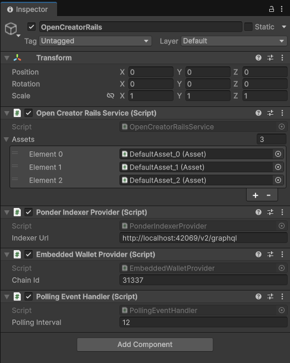

# open-creator-rails.unity

Unity SDK for the [Open Creator Rails](https://github.com/ChainSafe/open-creator-rails) Smart Contracts project. It provides a set of Unity-friendly components and services that make it easy to integrate on-chain subscription-based access control, expiration-based entitlements mapped as `[subject, resourceId] → expirationTime`, directly into your Unity game or application.

## Related Projects

| Repository | Description |
|------------|-------------|
| [open-creator-rails](https://github.com/ChainSafe/open-creator-rails) | Smart Contracts |
| [open-creator-rails.indexer](https://github.com/ChainSafe/open-creator-rails.indexer) | Indexer |
| [open-creator-rails.sdk](https://github.com/ChainSafe/open-creator-rails.sdk) | TypeScript SDK |
| [open-creator-rails.demo](https://github.com/ChainSafe/open-creator-rails.demo) | Web Demo |

---

## Installation

### Prerequisites

Before installing the package you must add the OpenUPM Scoped Registry to your Unity project:

1. Open **Edit → Project Settings → Package Manager**
2. Under **Scoped Registries**, click **+** and fill in:
   - **Name:** `OpenUPM`
   - **URL:** `https://package.openupm.com`
   - **Scope(s):** `com.cysharp`, `com.nethereum`
3. Click **Save**

### Install via Git URL

In the Unity Editor open **Window → Package Manager**, click **+** and select **Add package from git URL**, then enter:

```
https://github.com/ChainSafe/open-creator-rails.unity.git?path=io.chainsafe.open-creator-rails
```

---

## Setup

### 1. Add OpenCreatorRailsService to your scene

Add the `OpenCreatorRailsService` component to a GameObject in your scene. This component is a singleton (`DontDestroyOnLoad`) and acts as the central hub for all SDK functionality.

### 2. Add providers to the same GameObject

Add the following components to the **same GameObject** as `OpenCreatorRailsService` and fill in their serialized fields:

| Component | Required Fields | Notes |
|-----------|----------------|-------|
| `PonderIndexerProvider` | `Indexer Url` | Or implement `IIndexerProvider` |
| `EmbeddedWalletProvider` | `Chain Id` | Or implement `IWalletProvider` |
| `PollingEventHandler` | *(none)* | Or implement `IEventHandler` |

> `EmbeddedWalletProvider` reads wallet credentials from `Assets/secrets.json`. Create that file with:
> 
> ```json
> {
>   "mnemonic": "your twelve word mnemonic phrase here ...",
>   "rpcUrl": "https://sepolia.infura.io/v3/YOUR_KEY"
> }
> ```

### 3. Add Asset components to your scene

For each on-chain asset you want to track, add an `Asset` component to any GameObject in the scene and fill in its serialized fields:

| Field | Description |
|-------|-------------|
| `Registry Address` | Address of the deployed `AssetRegistry` contract |
| `Asset Id` | Human-readable asset identifier (e.g. `"default_asset_id"`) |

> **Note:** `Asset` components are registered automatically, any active `Asset` in the scene is picked up by the Editor as soon as it is added to the hierarchy and referenced in the **Assets** list on the `OpenCreatorRailsService` component. Deleting the GameObject or removing the `Asset` component removes it from the list.



---

## Usage

All examples assume you have completed the [Setup](#setup) steps and have a reference to the `OpenCreatorRailsService` singleton and at least one configured `Asset` component in your scene.

### 1. Connecting Your Wallet

Call `Connect()` on the service to initialize the wallet and load all asset state from the indexer. An optional index selects which HD wallet account to use (default `0`).

```csharp
using Io.ChainSafe.OpenCreatorRails;
using Cysharp.Threading.Tasks;

// Connect the default account (index 0).
// EmbeddedWalletProvider reads credentials from Assets/secrets.json.
await OpenCreatorRailsService.Instance.Connect();

// Connect a different HD account (e.g. account at derivation index 2)
await OpenCreatorRailsService.Instance.Connect(index: 2);

var connectedAccount = OpenCreatorRailsService.Instance.WalletProvider.ConnectedAccount;
```

After `Connect()` returns, every `IAsset` in the scene is populated with its on-chain state and event listeners are active.

---

### 2. Getting an Asset and Checking Subscriptions

Use `TryGetAsset` to retrieve a pre-configured asset by its human-readable ID. Subscription status queries are read-only and can be called by anyone — no permissions are required. To force a re-fetch of the asset's state from the indexer outside the normal event-driven cycle, call `await asset.Refresh()`.

```csharp
// Retrieve a configured asset by its human-readable ID.
// Pass an optional registryAddress to disambiguate if multiple registries share the same assetId.
if (!OpenCreatorRailsService.Instance.TryGetAsset("default_asset_id", out IAsset asset))
{
    Debug.LogError("Asset not found");
    return;
}

// The subscriberId is a plain string; the SDK automatically hashes it together
// with the currently-connected wallet address:
//   keccak256(abi.encode(subscriberId, connectedAccount))
// This means each (subscriberId, wallet) pair has its own unique on-chain identity.
string subscriberId = "user_123";

// Check whether the subscription is active (not expired AND not revoked).
// Read-only.
bool isActive = await asset.IsSubscriptionActive(subscriberId);

// Check expiry independently
bool isExpired = await asset.IsSubscriptionExpired(subscriberId);

// Check revocation status independently
bool isRevoked = await asset.IsSubscriberRevoked(subscriberId);

// Get the exact expiration time as a local DateTime
// Returns DateTime.MinValue if subscriber not found
DateTime expiresAt = await asset.GetSubscriptionExpiration(subscriberId);
```

---

### 3. Subscribing to an Asset

Call `Subscribe` to create a new subscription, or to extend/renew an existing one. Payment is handled via an ERC-2612 permit
> **no separate approval transaction is needed**.

The connected wallet is both the payer and subscriber address. The **payer is the refund beneficiary** if the subscription is later cancelled or revoked.

```csharp
// No special permission required.
// Reverts if the subscriber is permanently revoked on this asset;

string subscriberId = "user_123";

// Subscribe for 1 period. Pass a larger count to buy multiple periods at once.
BigInteger count = 1;

// Returns the new subscription expiration as a local DateTime.
DateTime newExpiry = await asset.Subscribe(subscriberId, count);

Debug.Log($"Subscribed! Access granted until: {newExpiry}");
```

> **Note:** The payment token must implement ERC-2612 (permit). The total token amount spent equals `SubscriptionPrice * count`. You can preview the cost before subscribing:
>
> ```csharp
> (BigInteger price, TimeSpan duration) = await asset.GetSubscriptionPriceAndDuration(count);
> ```

---

### 4. Canceling a Subscription

Call `CancelSubscription` to cancel the connected wallet's subscription. The SDK signs an off-chain cancellation proof.

```csharp
// The connected wallet must be the subscriber address
// (the same address used when the subscription was created).
// Reverts if the subscriber is permanently revoked.
// Only whole remaining subscription periods are refunded to the original payer.
// Partial (active) periods are non-refundable.

string subscriberId = "user_123";

await asset.CancelSubscription(subscriberId);

Debug.Log("Subscription cancelled.");
```

---

### 5. Setting a New Subscription Price

```csharp
// ASSET OWNER ONLY.
// Price is denominated in the token's smallest unit (e.g. wei for an 18-decimal token).
// Must be a non-zero multiple of 100 to preserve integer precision when splitting
// fees between creator and registry — reverts with InvalidSubscriptionPrice otherwise.

BigInteger newPriceInTokenWei = 100;   // replace with your desired price (non-zero multiple of 100)

await asset.SetSubscriptionPrice(newPriceInTokenWei);

// asset.SubscriptionPrice is automatically updated via SubscriptionPriceUpdated event.
Debug.Log($"New subscription price: {asset.SubscriptionPrice}");
```

---

### 6. Claiming Subscription Fees

Creator fees accrue pro-rata over completed subscription periods since the last claim. Any remaining "dust" from a fully-ended subscription is also claimable.

#### Single subscriber

```csharp
// ASSET OWNER ONLY.
// The primary overload takes a pre-computed subscriber identity hash:
//   keccak256(abi.encode(subscriberId, subscriberAddress))
// Use the ToSubscriberIdHash() extension to compute it:
string subscriberIdHash = "user_123".ToSubscriberIdHash(subscriberAddress);

BigInteger claimed = await asset.ClaimCreatorFee(subscriberIdHash);

// Or use the convenience overload that computes the hash for you:
// BigInteger claimed = await asset.ClaimCreatorFee("user_123", subscriberAddress);

Debug.Log($"Claimed creator fee: {claimed} (token wei)");
```

#### Batch (multiple subscribers)

```csharp
// ASSET OWNER ONLY.
// Subscribers with no accrued fee are silently skipped.
// Pass an array of pre-computed subscriber identity hashes:
string[] subscriberIdHashes =
{
    "user_123".ToSubscriberIdHash(addr1),
    "user_456".ToSubscriberIdHash(addr2),
    "user_789".ToSubscriberIdHash(addr3),
};

BigInteger totalClaimed = await asset.ClaimCreatorFee(subscriberIdHashes);

// Or use the convenience overload that computes hashes for you:
// BigInteger total = await asset.ClaimCreatorFee(new[] { ("user_123", addr1), ("user_456", addr2), ("user_789", addr3) });

Debug.Log($"Total creator fees claimed: {totalClaimed} (token wei)");
```

---

### 7. Revoking and Unrevoking a Subscriber

#### Revoking

Revocation immediately terminates a subscriber's access. All remaining time is refunded to the original payer(s), **including partial-period dust** (unlike cancellation, which only refunds whole periods). The subscriber is permanently blocked from resubscribing and cancelling until the Asset Owner calls `UnrevokeSubscription`.

```csharp
// ASSET OWNER ONLY.
// Reverts if the subscriber is already revoked.
// The primary overload takes a pre-computed subscriber identity hash:
//   keccak256(abi.encode(subscriberId, subscriberAddress))
string subscriberIdHash = "user_123".ToSubscriberIdHash(subscriberAddress);

await asset.RevokeSubscription(subscriberIdHash);

// Or use the convenience overload that computes the hash for you:
// await asset.RevokeSubscription("user_123", subscriberAddress);

Debug.Log("Subscriber revoked.");
```

#### Unrevoking

Lifts a permanent revocation, allowing the subscriber to resubscribe.

```csharp
// ASSET OWNER ONLY.
// The primary overload takes a pre-computed subscriber identity hash:
//   keccak256(abi.encode(subscriberId, subscriberAddress))
string subscriberIdHash = "user_123".ToSubscriberIdHash(subscriberAddress);

await asset.UnrevokeSubscription(subscriberIdHash);

// Or use the convenience overload that computes the hash for you:
// await asset.UnrevokeSubscription("user_123", subscriberAddress);

Debug.Log("Subscriber unrevoked.");
```