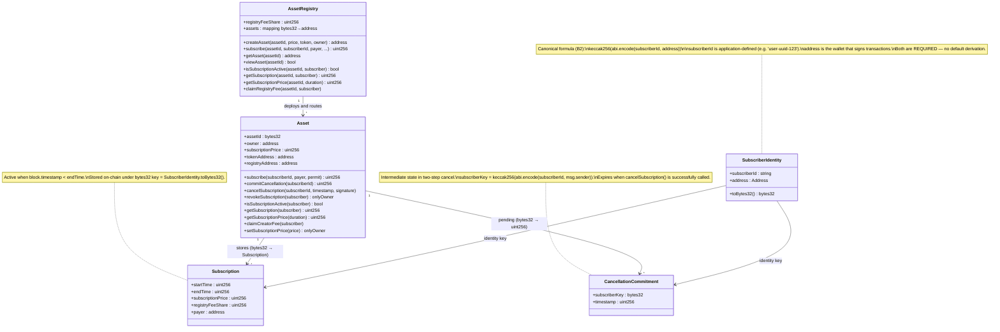

# 01 — Domain Model

Protocol-level concepts that both SDKs share. These classes/types have **no platform dependency** — they exist as pure data and behaviour contracts. Every SDK layer must faithfully represent them.

## Class Diagram

## Key Invariants

| Concept | Rule |
|---------|------|
| `SubscriberIdentity.toBytes32()` | `keccak256(abi.encode(subscriberId, address))` — both fields required |
| Subscription active | `block.timestamp < endTime` |
| On-chain authority | On-chain state supersedes indexer — indexer is a read cache only |
| Two-step cancel | `commitCancellation` → sign payload → `cancelSubscription` — single-step revocation is owner-only (`revokeSubscription`) |
| Fee split | Revenue split at subscription time; `registryFeeShare` is set at registry level |

## Events Emitted by Asset

| Event | When |
|-------|------|
| `SubscriptionAdded(bytes32 subscriber, uint256 startTime, uint256 endTime, uint256 nonce, address payer, uint256 price, uint256 registryFeeShare)` | New subscription |
| `SubscriptionExtended(bytes32 subscriber, uint256 endTime)` | Subscription renewed before expiry |
| `SubscriptionCancelled(bytes32 subscriber)` | Two-step cancel completed |
| `SubscriptionRevoked(bytes32 subscriber)` | Owner-revoked subscription |

> **Note:** `SubscriptionCancelled` emits only `bytes32 subscriber`. The original `subscriberId` string and `address` cannot be recovered from the event alone. This is a known indexer observability gap — see [05-current-divergences.md](./05-current-divergences.md).
