# 02 — SDK Interfaces

The shared abstractions both SDKs implement. These interfaces define the **unified surface** — the contract between application code and any platform-specific SDK. Adding a third SDK (e.g. mobile) means implementing these interfaces, nothing more.

## Class Diagram

```mermaid
classDiagram
    direction TB

    class IAssetClient {
        <<interface>>
        +address : Address
        +getAssetId() bytes32
        +getRegistryAddress() Address
        +getTokenAddress() Address
        +getSubscriptionPrice(duration) uint256
        +getSubscription(subscriber) uint256
        +getSubscriptionStatus(user, source?) SubscriptionStatus
        +isSubscriptionActive(subscriber) bool
        +getOwner(source?) Address
        +subscribe(subscriberId, payer, permit) TxHash
        +commitCancellation(subscriberId) TxHash
        +cancelSubscription(subscriberId, timestamp, signature) TxHash
        +revokeSubscription(subscriber) TxHash
        +claimCreatorFee(subscriber) TxHash
        +setSubscriptionPrice(price) TxHash
    }
    note for IAssetClient "Bound to a single Asset contract address.\nRead methods have no wallet requirement.\nWrite methods require IWalletProvider.\nsource: 'auto' | 'onchain' | 'indexer'"

    class ISubscriptionService {
        <<interface>>
        +getSubscriptionStatus(assetId, user, source?) SubscriptionStatus
        +getSubscriptionPrice(assetId, duration) uint256
        +subscribe(assetId, subscriberId, payer, permit) TxHash
        +commitCancellation(assetAddress, subscriberId) TxHash
        +cancelSubscription(assetAddress, subscriberId, timestamp, sig) TxHash
    }
    note for ISubscriptionService "Registry-level subscription operations.\nRoutes through AssetRegistry contract.\nTypeScript OcrSdk exposes this as AssetRegistry namespace."

    class IIndexerProvider {
        <<interface>>
        +getAsset(assetIdHash, registryAddress) AssetDto
        +getSubscription(assetAddress, user) SubscriptionDto
        +listSubscriptionsBySubscriberId(subscriberId) SubscriptionDto[]
    }
    note for IIndexerProvider "Read-only query layer backed by Ponder indexer.\nNever authoritative — always falls back to on-chain.\nTypeScript: OcrSdkIndexer. Unity: IIndexerProvider."

    class IWalletProvider {
        <<interface>>
        +chainId : uint256
        +connectedAccount : Address
        +connect(index?) void
        +signTypedData(message, typedData) Signature
        +disconnect() void
    }
    note for IWalletProvider "Platform-specific wallet/signer abstraction.\nTypeScript: viem WalletClient.\nUnity: IWalletProvider (Nethereum-backed)."

    class IPermitService {
        <<interface>>
        +getDomain() EIP712Domain
        +buildPermit(owner, spender, value, deadline) Permit
        +signPermit(permit) PermitSignature
    }
    note for IPermitService "EIP-2612 permit construction.\nTypeScript: viem signTypedData on ERC20Permit.\nUnity: ERC20PermitService (Nethereum EIP712)."

    class SubscriptionStatus {
        <<type>>
        +isActive : bool
        +endTime : uint256
    }

    IAssetClient --> IWalletProvider : requires for writes
    IAssetClient --> IIndexerProvider : optional query acceleration
    IAssetClient --> IPermitService : for subscribe (permit construction)
    ISubscriptionService --> IWalletProvider : requires for writes
    ISubscriptionService --> IIndexerProvider : optional query acceleration
    IAssetClient --> SubscriptionStatus : returns
    ISubscriptionService --> SubscriptionStatus : returns
```

## Interface Responsibilities

### `IAssetClient`

Asset-bound interface. Every method operates on a single, known Asset contract address. Application code should prefer this over raw registry calls wherever possible.

**subscribe flow:** requires `IPermitService` to build the ERC20 permit offline, then `IWalletProvider` to sign it, then calls `Asset.subscribe(subscriberBytes32, payer, spender, value, deadline, v, r, s)`.

**cancel flow:** two-step — `commitCancellation(subscriberId)` → wait for tx → sign the payload via `IWalletProvider` → `cancelSubscription(subscriberId, timestamp, signature)`.

### `ISubscriptionService`

Registry-level routing. Use when the Asset address is not yet known (only `assetId` is available). Resolves the asset address via `AssetRegistry.getAsset(assetId)` internally.

### `IIndexerProvider`

Optional GraphQL acceleration. Both SDKs accept a `source` parameter:
- `"auto"` (default) — try indexer, fall back to on-chain
- `"indexer"` — indexer only, throw if unavailable  
- `"onchain"` — skip indexer entirely

### `IWalletProvider`

The only platform-specific boundary for signing. Swap implementations to support embedded wallets, WalletConnect, MetaMask, etc., without changing any business logic.

### `IPermitService`

Separates permit construction from the wallet signer. Permit parameters (nonce, domain, amounts) are fetched on-chain by the service; only the final signature request goes to `IWalletProvider`.
