# 03 — Platform Adapters

Concrete SDK realizations for each platform. Both adapters implement the shared interfaces from [02-sdk-interfaces.md](./02-sdk-interfaces.md) using their respective blockchain libraries. Neither adapter is authoritative — they delegate truth to the on-chain contracts.

## Class Diagram

```mermaid
classDiagram
    direction TB

    %% ─── Shared interfaces (abbreviated) ───────────────────────────
    class IAssetClient {
        <<interface>>
        +subscribe(subscriberId, ...) TxHash
        +commitCancellation(subscriberId) TxHash
        +cancelSubscription(subscriberId, ts, sig) TxHash
        +getSubscriptionStatus(user, source?) SubscriptionStatus
        +isSubscriptionActive(subscriber) bool
    }

    class IWalletProvider {
        <<interface>>
        +chainId : uint256
        +connectedAccount : Address
        +connect(index?)
        +signTypedData(message, typedData) Signature
        +disconnect()
    }

    class IIndexerProvider {
        <<interface>>
        +getAsset(assetIdHash, registryAddress) AssetDto
        +getSubscription(assetAddress, user) SubscriptionDto
    }

    class IPermitService {
        <<interface>>
        +buildPermit(owner, spender, value, deadline) Permit
        +signPermit(permit) PermitSignature
    }

    %% ─── TypeScript SDK ─────────────────────────────────────────────
    class OcrSdk {
        +publicClient : PublicClient [viem]
        +walletClient? : WalletClient [viem]
        +registryAddress : Address
        +indexer? : OcrSdkIndexer
        +AssetRegistry : AssetRegistryNamespace
        +Asset : AssetNamespace
        +getAsset(assetAddress) OcrAssetClient
        +getSubscriptionStatus(assetId, user, source?) SubscriptionStatus
    }

    class OcrAssetClient {
        <<type — returned by OcrSdk.getAsset()>>
        +address : Address
        +subscribe(subscriberId, payer, permit) TxHash
        +commitCancellation(subscriberId) TxHash
        +cancelSubscription(subscriberId, ts, sig) TxHash
        +getSubscriptionStatus(user, source?) SubscriptionStatus
        +isSubscriptionActive(subscriber) bool
        +claimCreatorFee(subscriber) TxHash
        +revokeSubscription(subscriber) TxHash
    }

    class OcrSdkIndexer {
        <<type — GraphQL client>>
        +getSubscription(assetAddress, user) IndexerSubscription
        +getSubscriptionBySubscriberId(assetAddress, subscriberId) IndexerSubscription
        +getAsset(assetAddress) IndexerAssetEntity
        +listSubscriptionsBySubscriberId(subscriberId, ...) IndexerSubscription[]
        +listSubscriptionsByUser(user, ...) IndexerSubscription[]
        +listAssetsByRegistry(registryAddress, ...) IndexerAssetEntity[]
    }

    %% ─── Unity SDK ──────────────────────────────────────────────────
    class OpenCreatorRailsService {
        <<MonoBehaviour — singleton>>
        +Instance : OpenCreatorRailsService
        +WalletProvider : IWalletProvider
        +IndexerProvider : IIndexerProvider
        +Web3 : Web3 [Nethereum]
        +Assets : Asset[]
        +Connect(index?)
    }

    class Asset_Unity {
        <<MonoBehaviour — per-asset>>
        +AssetId : string
        +AssetIdHash : string
        +Address : EthereumAddress
        +SubscriptionPrice : BigInteger
        +Owner : EthereumAddress
        +TokenAddress : EthereumAddress
        +Service : AssetService [generated]
        +PermitService : ERC20PermitService [generated]
        +AssetRegistryService : AssetRegistryService [generated]
        +HasAccess(subscriberId) bool ✓ implemented
        +Subscribe(subscriberId, duration) DateTime ✓ implemented
        +GetSubscription(subscriberId) ⚠ TODO unity-17
        +CancelSubscription(subscriberId) ⚠ TODO unity-17
        +CommitCancellation(subscriberId) ⚠ TODO unity-17
        +SetSubscriptionPrice(price) ⚠ TODO unity-17
        +ClaimCreatorFee() ⚠ TODO unity-17
        +RevokeSubscription(subscriberId) ⚠ TODO unity-17
        +Connected(web3)
    }

    class EmbeddedWalletProvider {
        <<MonoBehaviour — IWalletProvider impl>>
        +ChainId : BigInteger
        +ConnectedAccount : EthereumAddress
        +Connect(index?) Web3
        +SignTypedData(message, typedData) EthECDSASignature
        +Disconnect()
    }

    class PonderIndexerProvider {
        <<MonoBehaviour — IIndexerProvider impl>>
        +IndexerUrl : string
        +GetAsset(assetIdHash, registryAddress) AssetDto
    }

    %% ─── Relationships ──────────────────────────────────────────────
    OcrSdk --> OcrAssetClient : creates via getAsset()
    OcrSdk --> OcrSdkIndexer : optional, created from indexerUrl
    OcrAssetClient ..|> IAssetClient : realizes
    OcrSdk ..> IWalletProvider : via viem WalletClient
    OcrSdk ..> IIndexerProvider : via OcrSdkIndexer

    OpenCreatorRailsService "1" --> "*" Asset_Unity : manages
    OpenCreatorRailsService --> EmbeddedWalletProvider : IWalletProvider
    OpenCreatorRailsService --> PonderIndexerProvider : IIndexerProvider
    Asset_Unity ..|> IAssetClient : partially realizes (unity-17 completes)
    EmbeddedWalletProvider ..|> IWalletProvider : realizes
    PonderIndexerProvider ..|> IIndexerProvider : realizes
```



## TypeScript SDK — Structural Notes

`OcrSdk` is instantiated with a `OcrSdkConfig`. Once created:

- **`sdk.getAsset(assetAddress)`** returns an `OcrAssetClient` bound to that address — the primary entrypoint for dApp developers.
- **`sdk.AssetRegistry.*`** and **`sdk.Asset.*`** are namespaced method collections for lower-level access.
- **`sdk.indexer`** is `undefined` when `indexerUrl` is not configured; all `source: "auto"` calls fall through to on-chain.
- `subscriberToId(subscriber)` in `utils.ts` currently derives `bytes32` from address only — **must be updated** to accept `(subscriberId: string, address: Address)` and use `keccak256(abi.encode(subscriberId, address))`.

## Unity SDK — Structural Notes

`OpenCreatorRailsService` is the singleton orchestrator. It does **not** own any contract logic itself — it wires together:

- `IWalletProvider` component (e.g. `EmbeddedWalletProvider`) — provides signing and account
- `IIndexerProvider` component (e.g. `PonderIndexerProvider`) — provides asset/subscription reads from indexer
- `Web3` (Nethereum) — RPC client, constructed on `Connect()`
- `Asset[]` — array of `Asset` MonoBehaviours, one per in-scene asset

Each `Asset` MonoBehaviour talks to three generated Nethereum services:
- `AssetService` — generated bindings for `Asset.sol`
- `ERC20PermitService` — generated bindings for ERC20Permit
- `AssetRegistryService` — generated bindings for `AssetRegistry.sol`

`SubscriberToId(subscriberId, address)` must replace the current `Extensions.Keccack256Bytes(string)` call at all call sites in `Asset.cs`.

## Subscriber Identity Derivation — Both Platforms

```
// Target formula (B2) — both SDKs must produce this
bytes32 subscriberKey = keccak256(abi.encode(subscriberId, subscriberAddress));

// TypeScript (target)
import { encodeAbiParameters, keccak256 } from "viem";
function subscriberToId(subscriberId: string, address: Address): Hex {
  return keccak256(encodeAbiParameters(
    [{ type: "string" }, { type: "address" }],
    [subscriberId, address]
  ));
}

// C# (target)
public static byte[] SubscriberToId(string subscriberId, string address) {
  return new Sha3Keccack().CalculateHash(
    ABI.ABIEncode(subscriberId, address)  // abi.encode(string, address)
  );
}
```

> Both formulas must produce identical `bytes32` for the same `(subscriberId, address)` pair. On-chain verification in `cancelSubscription` uses the same formula — any divergence causes irreversible subscription loss.
