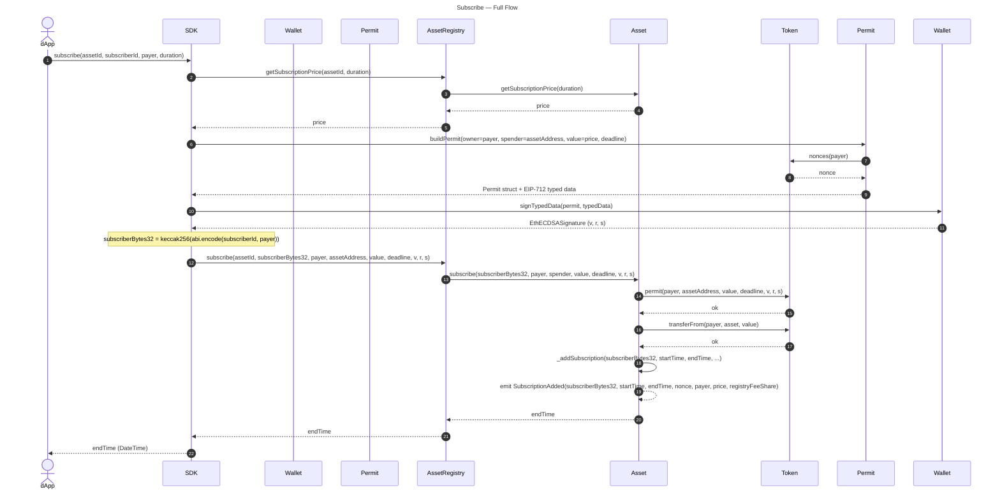
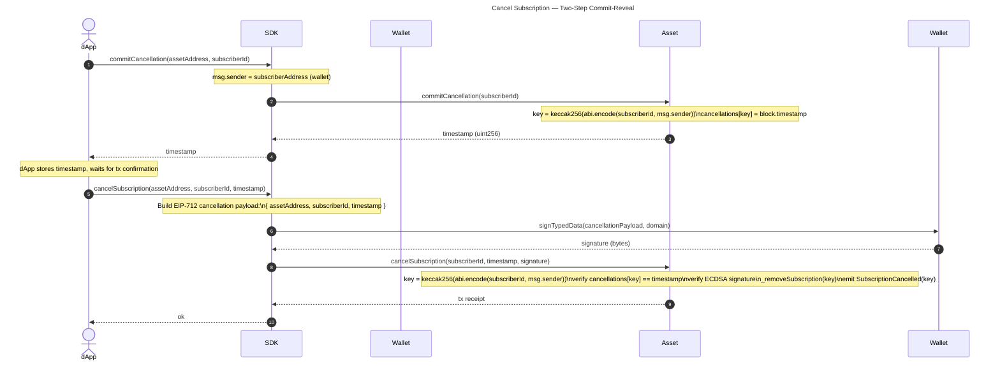
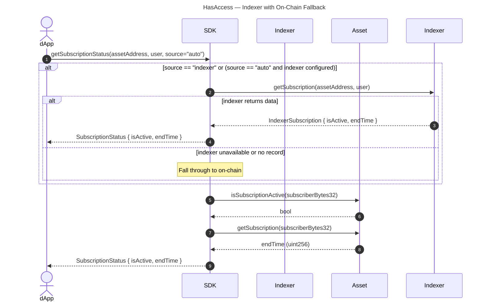

# 04 — Workflows

Sequence diagrams for the three core SDK workflows. These diagrams are normative — SDK implementations must conform to these interaction patterns.

---

## 1. Subscribe

A subscriber obtains access to an asset by paying via ERC20 permit (EIP-2612). The permit avoids a separate `approve` transaction.

**SDK responsibility:** derive `subscriberBytes32` before the contract call. Neither the registry nor the asset derives it — the SDK is the derivation boundary.

---

## 2. Cancel Subscription (Two-Step)

Subscriber-initiated cancellation uses a commit-reveal pattern to prevent front-running. The owner can bypass this with `revokeSubscription`.

**Key security properties:**
- The commit binds `(subscriberId, msg.sender)` on-chain — no other address can cancel for this subscriber.
- The reveal requires a valid ECDSA signature from the same wallet, preventing replay.
- Owner can always call `revokeSubscription(bytes32 subscriber)` as an emergency escape hatch — this is single-step.

---

## 3. HasAccess (with On-Chain Fallback)

Access checks use the indexer for speed but always fall back to the authoritative on-chain state.

**Source parameter semantics:**

| `source` | Behaviour |
|----------|-----------|
| `"auto"` (default) | Indexer if configured → on-chain if indexer fails or returns nothing |
| `"indexer"` | Indexer only — throws if unavailable |
| `"onchain"` | On-chain only — skips indexer entirely |

**Unity note:** `HasAccess(subscriberId)` currently calls `isSubscriptionActive(Keccack256Bytes(subscriberId))` directly on-chain (no indexer fallback). The on-chain path is correct once the derivation formula is fixed; indexer fallback is tracked as an enhancement (see [05-current-divergences.md](./05-current-divergences.md)).
