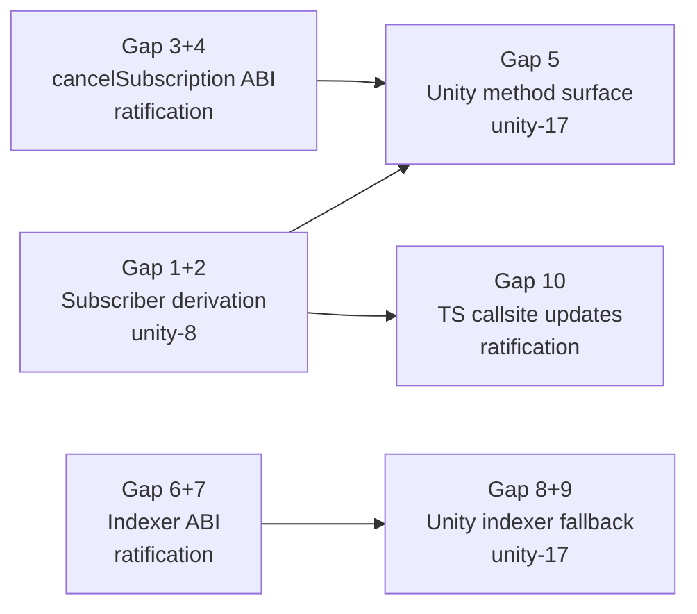

# 05 — Current Divergences

This document is the **living gap register** between the target unified SDK interface (as defined in this architecture set) and the current state of each SDK implementation. Every row has an explicit alignment action tracked in a GitHub issue.

Last updated: 2026-05-02. Re-audit after each SDK release.

---

## Gap Table

| # | Area | SDK | File | Current state | Target state | Severity | Issue |
|---|------|-----|------|---------------|--------------|----------|-------|
| 1 | Subscriber derivation formula | Unity | `io.chainsafe.open-creator-rails/Runtime/Utils/Extensions.cs` | `Sha3Keccack.CalculateHash(string)` — hashes the hex string, not ABI-encoded bytes | `keccak256(abi.encode(subscriberId, address))` | **CRITICAL** — causes silent subscription miss | unity-8 |
| 2 | Subscriber derivation formula | TypeScript | `open-creator-rails.sdk/src/utils.ts` | `keccak256(encodePacked(["address"], [subscriber]))` — address-only, no `subscriberId` | `keccak256(abi.encode(subscriberId, address))` both inputs | **CRITICAL** — incompatible with contract's cancel flow | unity-8 / ratification |
| 3 | `cancelSubscription` ABI | Unity | `io.chainsafe.open-creator-rails/Runtime/Asset.cs` | Not implemented (TODO comment) | `commitCancellation(subscriberId)` → sign → `cancelSubscription(subscriberId, timestamp, sig)` | **HIGH** — missing feature | unity-17 |
| 4 | `cancelSubscription` ABI | TypeScript | `open-creator-rails.sdk/src/client.ts` | Calls `cancelSubscription(subscriberToId(subscriber))` — old single-arg ABI | Two-step: `commitCancellation(subscriberId)` then `cancelSubscription(subscriberId, ts, sig)` | **HIGH** — broken against current contract | ratification |
| 5 | Missing Asset methods | Unity | `io.chainsafe.open-creator-rails/Runtime/Asset.cs` | Only `HasAccess` and `Subscribe` implemented; 6 methods are TODO | `GetSubscription`, `CancelSubscription`, `CommitCancellation`, `SetSubscriptionPrice`, `ClaimCreatorFee`, `RevokeSubscription` | **HIGH** — incomplete surface | unity-17 |
| 6 | Indexer ABI — `cancelSubscription` | Indexer | `open-creator-rails.indexer/config/AssetABI.ts` | Old signature `(bytes32)` | `(string, uint256, bytes)` | **HIGH** — indexer ignores cancel events | ratification |
| 7 | Indexer ABI — `SubscriptionAdded` event | Indexer | `open-creator-rails.indexer/config/AssetABI.ts` | Missing `nonce`, `payer`, `subscriptionPrice`, `registryFeeShare` fields | Full 7-field event as in `Asset.sol` | **HIGH** — indexer silently drops subscription data | ratification |
| 8 | HasAccess indexer fallback | Unity | `io.chainsafe.open-creator-rails/Runtime/Asset.cs` | On-chain only — no indexer path | `source: "auto"` — indexer first, on-chain fallback | MEDIUM — access denied during indexer outage | unity-17 |
| 9 | `IIndexerProvider` coverage | Unity | `io.chainsafe.open-creator-rails/Runtime/IIndexerProvider.cs` | Only `GetAsset(assetIdHash, registryAddress)` | Add `GetSubscription(assetAddress, user)` for hasAccess fallback | MEDIUM | unity-17 |
| 10 | `subscriberToId` call sites | TypeScript | `open-creator-rails.sdk/src/client.ts` | All calls pass address only: `subscriberToId(params.subscriber)` | All calls pass both: `subscriberToId(subscriberId, params.subscriber)` | Blocked on gap #2 | unity-8 / ratification |
| 11 | Indexer observability of cancelled `subscriberId` | All | Contract event `SubscriptionCancelled` | Emits only `bytes32 subscriber` — original string and address unrecoverable from event | Known limitation — document and monitor | LOW — informational | — |

---

## Gap Details

### Gap 1 & 2 — Subscriber Derivation (CRITICAL)

**Root cause:** PRs #115 and #119 to `open-creator-rails` changed `cancelSubscription` to accept `string subscriberId` and derive `bytes32` on-chain as `keccak256(abi.encode(subscriberId, msg.sender))`. No SDK was updated.

**Impact:**
- Existing TypeScript SDK subscribers registered using `keccak256(encodePacked(address))` cannot cancel their own subscriptions — the key doesn't match.
- Unity SDK subscribers registered using `Sha3Keccack(hexString)` are also on a different key and cannot be looked up.
- Migration: owner-revocation (`revokeSubscription`) is the only escape hatch for existing subscribers.

**Alignment action:**

_TypeScript_ (`open-creator-rails.sdk/src/utils.ts`):
```typescript
// Replace:
export function subscriberToId(subscriber: Address): Hex {
  return keccak256(encodePacked(["address"], [subscriber]));
}

// With:
export function subscriberToId(subscriberId: string, address: Address): Hex {
  return keccak256(encodeAbiParameters(
    [{ type: "string" }, { type: "address" }],
    [subscriberId, address]
  ));
}
```

_Unity_ (`Extensions.cs`):
```csharp
// Replace Extensions.Keccack256Bytes(string):
// With new method:
public static byte[] SubscriberToId(string subscriberId, string address) {
    // ABI-encode (string, address) then keccak256
    // Uses Nethereum ABIEncode for abi.encode parity
}
```

### Gap 3 & 4 — cancelSubscription ABI (HIGH)

**Root cause:** Same PRs #115/#119. The TypeScript SDK `cancelSubscription` method calls a one-argument function that no longer exists on the contract.

**Alignment action (TypeScript):**
```typescript
// Add to OcrSdk:
async commitCancellation(params: { assetAddress: Address; subscriberId: string }): Promise<Hex>
async cancelSubscription(params: { assetAddress: Address; subscriberId: string; timestamp: bigint; signature: Hex }): Promise<Hex>
```

**Alignment action (Unity):** Implement in `Asset.cs` as part of unity-17.

### Gap 5 — Missing Unity Methods (HIGH)

`Asset.cs` has 6 TODO stubs. Implement after gap #1 is resolved (correct derivation is a prerequisite):

| Method | Contract call |
|--------|--------------|
| `GetSubscription(subscriberId)` | `AssetService.GetSubscriptionQueryAsync(SubscriberToId(subscriberId, account))` |
| `CommitCancellation(subscriberId)` | `AssetService.CommitCancellationRequestAsync(subscriberId)` |
| `CancelSubscription(subscriberId, timestamp, sig)` | `AssetService.CancelSubscriptionRequestAsync(subscriberId, timestamp, sig)` |
| `SetSubscriptionPrice(price)` | `AssetService.SetSubscriptionPriceRequestAsync(price)` |
| `ClaimCreatorFee()` | `AssetService.ClaimCreatorFeeRequestAsync(subscriber)` |
| `RevokeSubscription(subscriberId)` | `AssetService.RevokeSubscriptionRequestAsync(SubscriberToId(subscriberId, account))` |

### Gap 11 — Indexer Observability Limitation (Known)

`SubscriptionCancelled(bytes32 indexed subscriber)` emits only the derived key, not the original `subscriberId` string or address. This means:

- The indexer cannot build a reverse map from cancellation events.
- `listSubscriptionsBySubscriberId` may return stale `isActive: true` until the indexer re-checks on-chain state.

**Mitigation:** `getSubscriptionStatus` with `source: "auto"` always falls through to on-chain if indexer shows active but on-chain shows cancelled. No action required until indexer consistency SLA is defined.

---

## Alignment Roadmap


