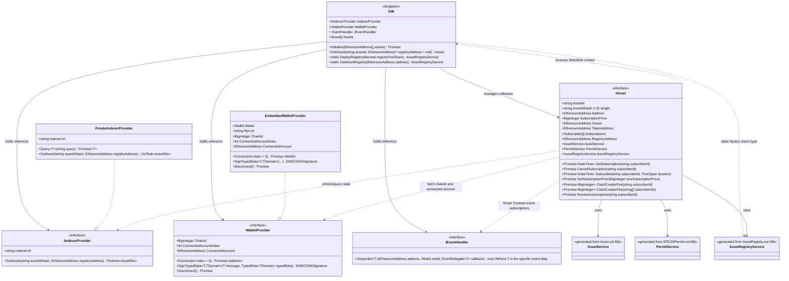

# SDK Class Diagram

This document captures the current high-level SDK architecture and how the runtime components collaborate.

## Class Roles

- `Sdk`: the singleton orchestration entry point. It owns references to provider abstractions and the in-memory asset collection, and exposes helper factory methods for registry-level contract services.
- `IIndexerProvider`: abstraction for indexer reads. Implementations are responsible for looking up asset state from indexed chain data.
- `IWalletProvider`: abstraction for account connectivity and EIP-712 signing. It provides chain/account context used by write flows.
- `IEventHandler`: abstraction for contract event subscriptions. It attaches event delegates to contract addresses and typed event DTOs.
- `IAsset`: runtime asset abstraction combining identity, on-chain state projections, contract services, and subscriber/owner operations.
- `PonderIndexerProvider`: concrete indexer implementation of `IIndexerProvider`, backed by query-based indexer requests.
- `EmbeddedWalletProvider`: concrete wallet implementation of `IWalletProvider`, backed by an embedded HD wallet and RPC connection.
- `AssetService`, `PermitService`, `AssetRegistryService`: generated ABI service clients used by `IAsset` and `Sdk` for on-chain interactions.

## Relationship Notes

- `Sdk` depends on interfaces (`IIndexerProvider`, `IWalletProvider`, `IEventHandler`, `IAsset`) instead of concrete classes, so implementations can be swapped without changing orchestration logic.
- `PonderIndexerProvider` and `EmbeddedWalletProvider` realize their respective interfaces, giving concrete transport/signing behavior.
- `IAsset` composes three generated service clients to separate asset contract calls, permit/token calls, and registry calls.
- `IAsset` queries indexer state through `IIndexerProvider`, uses wallet context through `IWalletProvider`, and delegates event wiring to `IEventHandler`.
- `Sdk` manages `IAsset` instances and provides lifecycle/init context consumed by each asset.
